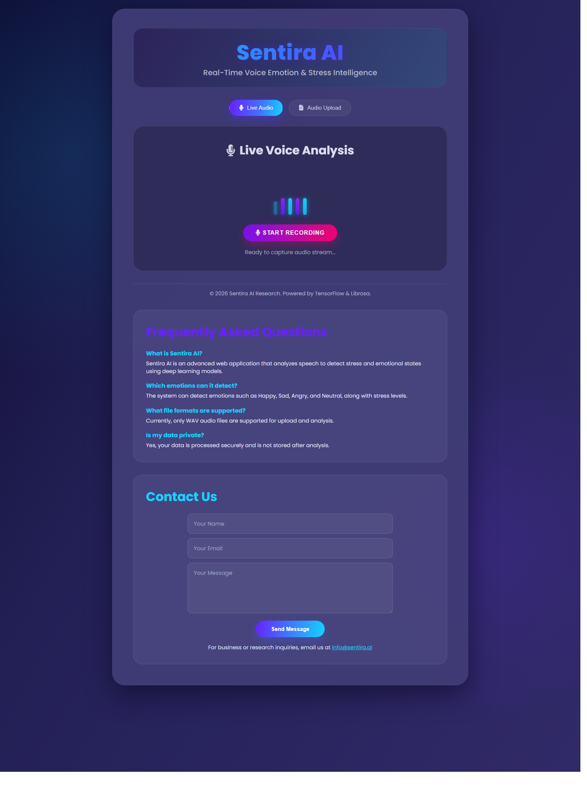
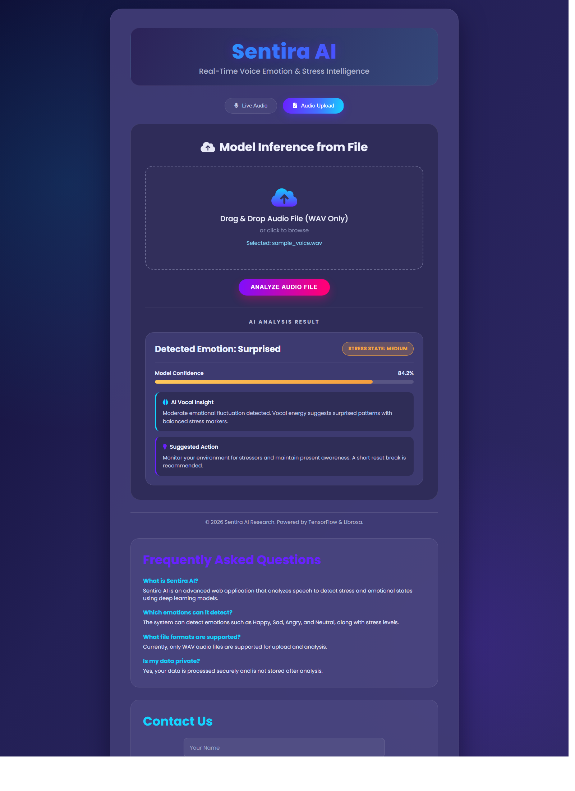
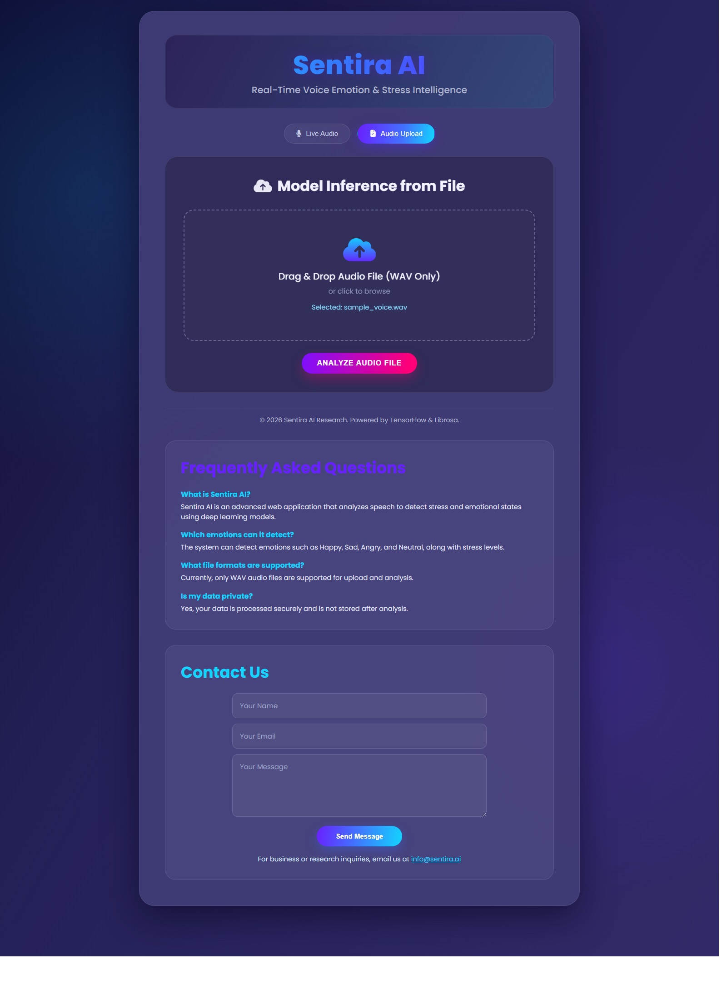
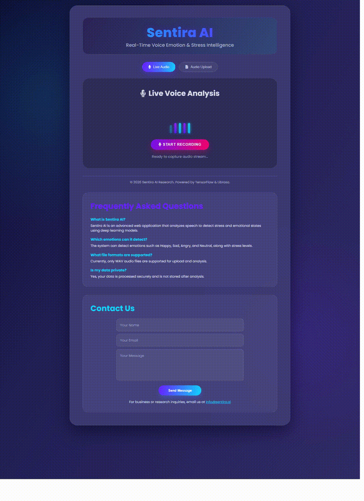

# Sentira AI: Real-Time Voice Emotion & Stress Intelligence

Sentira AI is a Flask-based machine learning web application for audio-driven emotion recognition and stress level inference.
Users can upload voice/audio samples, and the system extracts acoustic features (MFCC-based) and predicts:

- Primary emotion class
- Stress category (Low / Medium / High)
- Confidence score and top-class probabilities

This repository demonstrates practical ML engineering across preprocessing, model inference, and web integration.

---

## 1. Project Overview

This project combines:

- A Flask web interface and API
- TensorFlow/Keras model inference
- Audio feature engineering with `librosa`
- Stress interpretation logic layered on top of emotion predictions

Main use case: quickly assess emotional/stress cues from short speech clips.

---

## 2. Screenshots / Example Output

### App Home


### Inference Result Card


### Upload + Analysis Flow


---

## 3. Features

- Modern Flask web UI for voice-stress analysis
- Audio upload-based inference workflow
- Multi-window inference stabilization for noisy/real-world mic recordings
- Confidence calibration to reduce overconfident outputs
- Stress mapping layer (emotion -> stress interpretation)
- Health endpoint for deployment/runtime checks
- Render-ready Docker configuration

---

## 4. Model Overview

Core model and ML pipeline files:

- `Project/flexible_stress_model.py`
- `Project/universal_preprocessing.py`

Inference flow:

1. Load audio
2. Trim silence and select informative segments
3. Extract MFCC features
4. Run model prediction
5. Aggregate probabilities and compute calibrated confidence
6. Map emotion output to stress state

Model artifacts are stored under:

- `Project/models/universal/`
  - Example: `universal_model_model.keras`
  - Config/scaler files in the same folder
  - If exporting a `.h5` variant, place it here as well and update loader paths if needed

---

## 5. Requirements

Python dependencies (from `requirements.txt`):

- `flask`
- `tensorflow`
- `numpy`
- `pandas`
- `librosa`
- `soundfile`
- `scikit-learn`
- `matplotlib`
- `seaborn`
- `pydub`
- `gunicorn`

Recommended:

- Python 3.10+
- FFmpeg installed for wider audio compatibility

---

## 6. Setup Instructions (Virtual Environment Recommended)

From repository root:

```bash
cd Project
python -m venv .venv
```

Activate environment:

```bash
# Windows (PowerShell)
.venv\Scripts\Activate.ps1

# macOS/Linux
source .venv/bin/activate
```

Install dependencies:

```bash
pip install --upgrade pip
pip install -r requirements.txt
```

---

## 7. Run Locally

From `Project/`:

```bash
python app.py
```

Open in browser:

```text
http://127.0.0.1:5000
```

Health check:

```text
http://127.0.0.1:5000/health
```

---

## 8. Input / Output Expectations

### Input

- Audio file upload via UI or API form-data
- Supported by backend preprocessing: `.wav`, `.webm`, `.ogg`, `.mp3`, `.flac`, `.m4a`, `.mp4`
- Best results typically come from clean speech clips (~2-5 seconds)

### Output (JSON)

Example response:

```json
{
  "result": "Medium Stress",
  "confidence": 0.8421,
  "emotion": "surprised",
  "raw_confidence": 0.9012,
  "top2": {
    "primary": { "emotion": "surprised", "probability": 0.9012 },
    "secondary": { "emotion": "happy", "probability": 0.0550 }
  }
}
```

---

## 9. Example API Usage / User Workflow

### A) User Workflow (UI)

1. Open app in browser
2. Upload an audio file (or use mic if enabled)
3. Click Analyze
4. Review predicted emotion, stress state, confidence, and guidance

### B) API Example (`curl`)

```bash
curl -X POST "http://127.0.0.1:5000/predict_audio" \
  -F "file=@sample.wav"
```

---

## 10. Deployment Attempts & Current Status

This project has been prepared for container-based deployment (including Render automation files).
However, at the time of writing:

- A fully stable public deployment URL is not guaranteed
- Local execution remains the primary reliable mode

Deployment-related files:

- `render.yaml` (repo root)
- `Project/Dockerfile`
- `Project/.dockerignore`

---

## 11. Tips for Recruiters / Reviewers

To evaluate quickly:

1. Run locally using the steps above
2. Test with a few short audio clips representing different emotions
3. Review inference code and feature pipeline:
   - `Project/app.py`
   - `Project/universal_preprocessing.py`
   - `Project/flexible_stress_model.py`
4. Check API response consistency (`/predict_audio`) and service health (`/health`)
5. Inspect model artifacts in `Project/models/universal/`

What to assess:

- End-to-end ML integration quality
- Practical handling of noisy real-world audio
- Engineering of confidence and post-processing logic
- Production-readiness of deployment scaffolding

---

## 12. Code Structure

```text
Stress_Detection_Multi_beforeDeployment/
|-- render.yaml
`-- Project/
   |-- app.py
   |-- config.py
   |-- flexible_stress_model.py
   |-- universal_preprocessing.py
   |-- requirements.txt
   |-- Dockerfile
   |-- templates/
   |  `-- index.html
   |-- static/
   |  |-- style.css
   |  `-- script.js
   `-- models/
      `-- universal/
```

---

## 13. Demo GIF / Video

### Demo GIF


### Demo Video
- MP4 recording: [Download/View Demo Video](./docs/demo/sentira-demo.mp4)
- YouTube Walkthrough (placeholder): [Watch Demo Video](https://www.youtube.com/watch?v=YOUR_VIDEO_ID)

---

## 14. Contact / Portfolio

- LinkedIn: [Linkedin](www.linkedin.com/in/vyuhita-gunupudi)
- Email: `vyuhitasamarpangunupudi@gmail.com`

**Note**: Replace the contact information above with your actual details.

---

